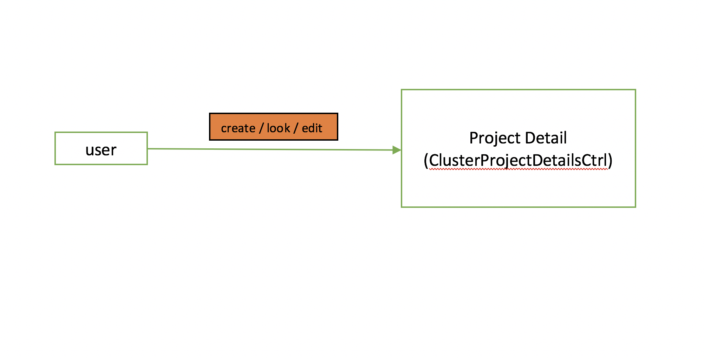
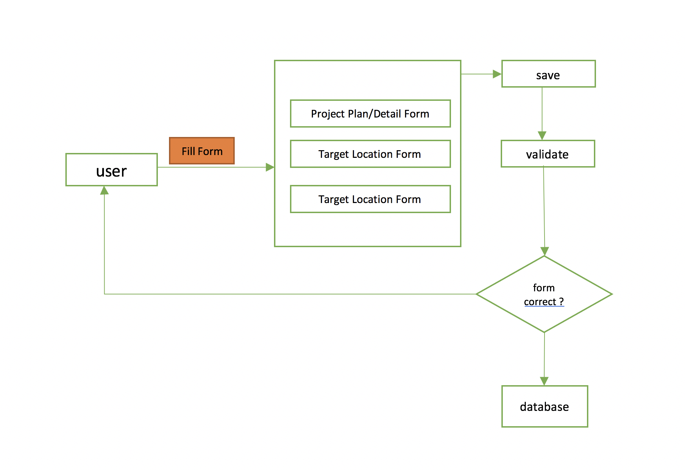
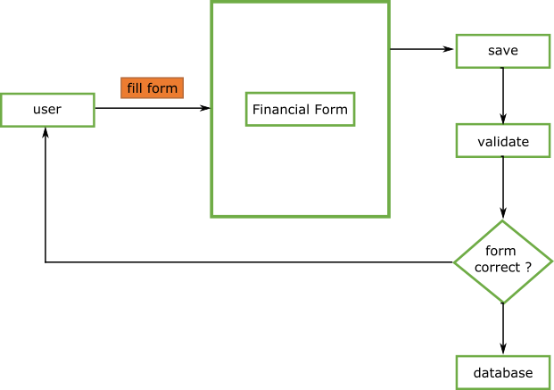
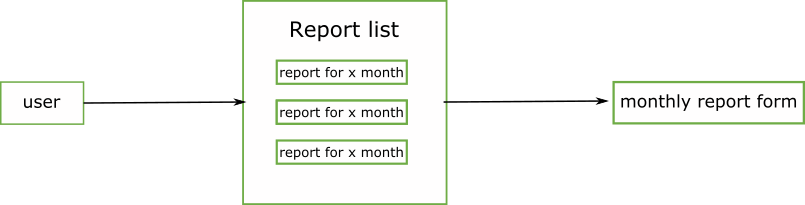
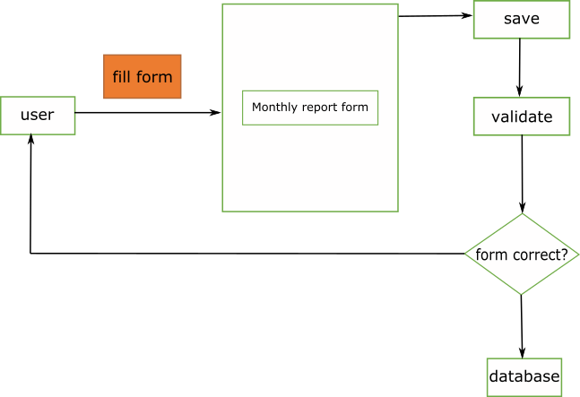

## ReportHub Main Module

ReportHub build using many third party library like on diagram above.  

###
Reference Third Party Library :  

-	**ngRaven** : [raven-js](https://raven-js.readthedocs.io/en/stable/integrations/angular.html "Title")
-	**pascalprecth.translate** : [angular-translate](https://angular-translate.github.io/docs/#/guide "Title")
-	**ngAnimate** : [angular-animate](https://docs.angularjs.org/api/ngAnimate)
-	**ngCookies** : [angular-cookies](https://docs.angularjs.org/api/ngCookies)
-	**ngResource**: [angular-resource](https://docs.angularjs.org/api/ngResource)
-   **ngRoute**   : [angular-route](https://docs.angularjs.org/api/ngRoute)
-   **ngSanitize**: [angular-sanitize](https://docs.angularjs.org/api/ngSanitize)
-   **ngTouch**: [angular-touch](https://docs.angularjs.org/api/ngTouch)
-   **ngTable**: [ng-table](https://esvit.github.io/ng-table/api-docs/index.html)
-   **ngCsv**: [ng-csv](https://github.com/asafdav/ng-csv)
-   **ngDropzone**: [ng-dropzone](https://github.com/thatisuday/ng-dropzone)
-   **ngCountTo**: [ng-count-to](https://github.com/pfitzpaddy/angular-filter-count-to)
-   **ngAria**: [angular-aria](https://docs.angularjs.org/api/ngAria)
-   **ngMaterial**: [angular material](https://material.angularjs.org/1.1.0/getting-started)
-   **highcharts-ng**: [highcharts](https://github.com/pablojim/highcharts-ng)
-   **leaflet-directive**: [leaflet](https://tombatossals.github.io/angular-leaflet-directive/#!/)
-   **xeditable**: [angular-xeditable](https://vitalets.github.io/angular-xeditable/)
-   **infinite-scroll**: [ng-infinite-scroll](https://sroze.github.io/ngInfiniteScroll/)
-   **angularUtils.directives.dirPagination**: [pagination directive](https://github.com/michaelbromley/angularUtils/tree/master/src/directives/pagination)

For the custom module is module made by reporthub team to provide specific function in Reporthub.  

### Custom Module 
- **ngm.widget.form.authentication**
- [**ngm.widget.project.details**](/module/#12-clusterprojectformdetailsctrl)
- [**ngm.widget.project.financials**](/module/#21-clusterprojectfinancialsctrl)
- [**ngm.widget.project.report**](/module/#3-monthly-report)
- [**ngm.widget.organization.stocks.list**](/module/#41-clusterorganizationstockslistctrl)
- [**ngm.widget.organization.stock**](/module/#43-clusterorganizationstockreportctrl)
- **ngm.widget.form.organization.list**
- **ngm.widget.upload.beneficiaries.stock.report**
- [**ngmCluster**](/module/#cluster-module) 
- **ngmiMMAP**

### Custom Module for Country
- **ngmBangladesh**
- **ngmEthiopia**

### Custom Module for Cluster
- **ngmNutrition**
### Custom Module for Project
- **ngmDews**
- **ngmDrr**
- **ngmEpr**
- **ngmSbp**
- **ngmDrought**

## Cluster Module

Inside Cluster Module there are Dashboard Feature and Reports Feature.

Dashboard Feature purpose  to summarize all data collected by ReportHub and then show it to user
Report Feature is to create report based on project and record every progress of the project by user

### Reports
 
Report Have 4 main function

#### 1. Project Plan/Detail
#### 1.1 ClusterProjectDetailsCtrl
`Controller: ClusterProjectDetailsCtrl`

The purpose of this controller is to make new  Project Detail/Plan or to retrieve Project Detail/Plan that already made. In the Project Detail there are 3 main form

-	From Project Plan (mandatory)
-	Form Target Location ( mandatory)
-	Form  Target Beneficiaries (optional)
-	Etc.

All form above manage by  ClusterProjectFormDetailsCtrl Controller on **ngm.widget.project.details** module.

#### 1.2 ClusterProjectFormDetailsCtrl
`Module:ngm.widget.project.details`  
`Controller : ClusterProjectFormDetailsCtrl`

Within this controller there are several services used, are as follows :  

- ngmClusterLists : to provide list that used in the form like list activities, list clusters and many more
- ngmClusterHelper : to create or set up new project 
- ngmClusterBeneficiaries: to set form for target beneficiaries 
- ngmClusterLocations: to set up the location in target location form
- ngmClusterValidation : to validate form 

Function in this controller

- addLocation           :  function to add location in target location form. this function get the template attribute from function addLocation     
                           **ngmClusterLocations**.
                           and set list Admin1,2,3 (Province,district and etc.) for the form using function filterLocations() in **ngmClusterLocations**.
- addLocationFromFile   :  function to add location by uploading file (CSV or Excel). 
- addBeneficiary        :  to add target beenficiary for the project . this function get the template attribute from 
                           addBeneficiary **ngmClusterBeneficiaries**. and set the list for input in target beneficiary form. 
- validate              : function to validate all form  using ** [ngmClusterValidation validate](/services/#validate "Title") ** function.

#### 2. Financial 
#### 2.1 ClusterProjectFinancialsCtrl
`Controller : ClusterProjectFinancialsCtrl`  

The purpose of this controller is to make report about budget(financial) on a project. In the Financial have a form.  

The form manage by ClusterProjectFormFinancialCtrl Controller on **ngm.widget.project.financials** module. 

#### 2.2 ClusterProjectFormFinancialCtrl  
`Module:ngm.widget.project.financials`  
`Controller : ClusterProjectFormFinancialCtrl`

Within this controller there are several services used, are as follows :  
- ngmClusterLists : to provide currencies list that used in the form.
- ngmClusterFinancial: to provide some function that used in controller.

Function in this controller

- addBudgetItem                     : function to add budget in form.  
- validateFinancialDetailsForm      : function to validate the form using **[ngmClusterFinancial validateBudgets]()** function.  
- removeBudgetItem                  : function to remove budget.  

#### 3. Monthly Report
  
#### 3.1 ClusterProjectReportsListCtrl
`Controller : ClusterProjectReportsListCtrl`

The purpose of this controller purpose is to show report for each month based on project periode.
ClusterProjectReportsListCtrl Controller is to retrieve report that should be completed by user based on month.

#### 3.2 ClusterProjectReportCtrl
`Controller : ClusterProjectReportCtrl`

The purpose of this controller is to make report monthly . The Monthly Report have a form that manage by ClusterProjectFormReportCtrl.  
In Monthly report form the main information that should be reported is beneficiary, so the form that should be completed is beneficiary form.  

#### 3.3 ClusterProjectFormReportCtrl
`Module:ngm.widget.project.report`  
`Controller : ClusterProjectFormReportCtrl`
  

Within this controller there are several services used, are as follow :  

- ngmClusterLists : to provide currencies list that used in the form.
- ngmClusterHelper : to clean the report
- ngmClusterBeneficiaries: to set form for beneficiaries , to set intial atrribute to make new beneficiary, to remove report etc.
- ngmClusterValidation : to validate the form

function in this controller

- addBeneficiary   : function to add beneficairy in form. Using **[ngmClusterBeneficiaries addBeneficiary](/services/#addbeneficiary)** function to set inital attribute/property  and **[ngmClusterBeneficiaries setBeneficiariesInputs](/services/#setbeneficiariesinputs)** function to set the input that will be used in form.
- copyPreviousMonth: function to copy report from previous month report.
- removeBeneficiary: function to remove beneficiary from report using ** [ngmClusterBeneficiaries removeBeneficiary](/services/#removebeneficiary "Title") **
- removeReport: functiom remove report
- validateBeneficiariesDetailsForm: function to validate all beneficiary form the monthly report using **[ngmClusterValidation validateBeneficiaries](/services/#validatebeneficiaries "Title")** function.

#### 4. Stock Report
#### 4.1 ClusterOrganizationStocksListCtrl
This Controller purpose is to show stock report for each month based on project periode.
ClusterOrganizationStocksListCtrl Controller is to retrieve report that should be completed by user based on month.
Another  purpose is to add a location warehouse for stock. Form to add new location is manage by ClusterOrganizationStocksFormList Controller on **ngm.widget.organization.stocks.list** .  

#### 4.2 ClusterOrganizationStocksFormList
`Module: ngm.widget.organization.stocks.list`  
`Controller: ClusterOrganizationStocksFormList`

Within this controller there are several services used, are as follow :
- ngmClusterHelper : to set new location  attribute

function in this controller 

- addlocation : function to add new warehouse location
- removeLocation: function to remove warehouse location 

#### 4.3 ClusterOrganizationStockReportCtrl
The purpose of this controller is to make stock report . The Stock Report have form that manage by ClusterOrganizationStockForm Controller on **ngm.widget.organization.stock** module  

#### 4.4 ClusterOrganizationStockForm
`Module: ngm.widget.organization.stock`  
`Controller: ClusterOrganizationStockForm`   

Within this controller there are several services used, are as follow :  

- ngmClusterLists : to provide currencies list that used in the form.
- ngmClusterHelper : to clean the report

function in this controller

- addStock :  function to add stock in form
- removeStock : functio to remove stock from report
- validateForm : function to validate stock form
- copyPrevReport : function to copy report stock from previous report.  

## Authentication Module  
A module that provides a function to authenticating and manage user (CRUD) using ngmAuth services. 
And the controller that manage all the form for authentication are `AuthenticationFormCtrl`.   
Below is list of function that provides by this module.  

#### 1. Sign In / Register
#### 2. Log In
#### 3. Log Out
#### 4. Update Profile
#### 5. Delete User
#### 6. Reset Password
#### 7. Manage User Access

<!-- ## Custom Module -->

<!-- 

Custom Module are Module to make an instant module for specific project or program -->
