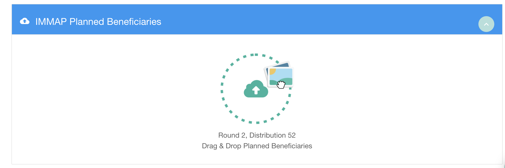
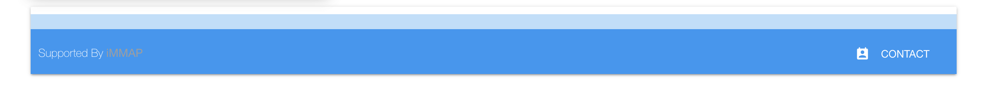
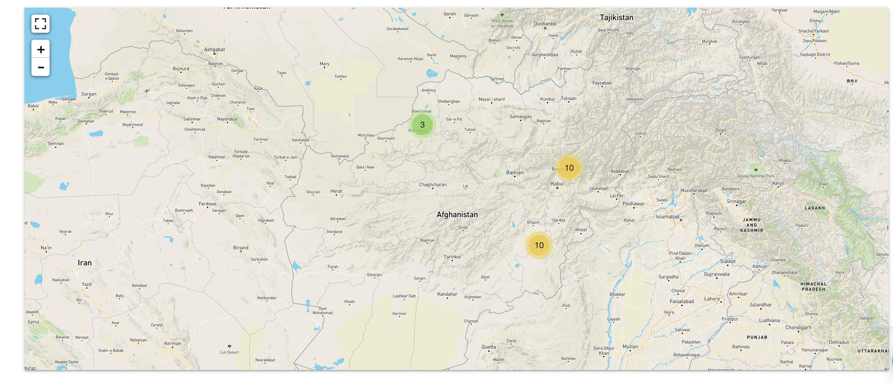
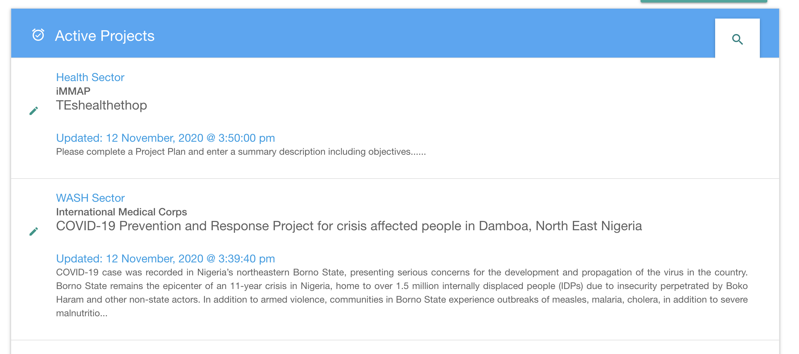
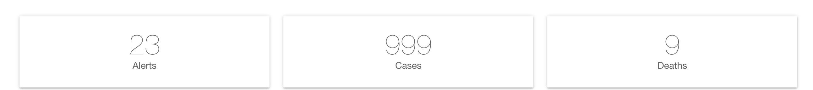
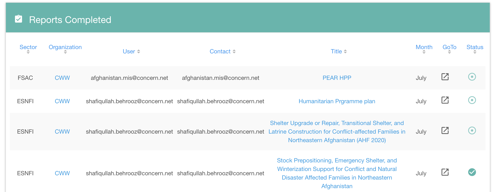

## What is widget ?
Widget are some simple component with specific function.

## List of Widget

### 1. ngm-calHeatmap
 Widget used to create calender heatmap  

**How to use**   
 Put snippet code below  in your model
```
widgets: [{
                type: 'calHeatmap',
                card: 'card-panel',
                config: { * optional*}
			}]
```
 Example :
```
$scope.model = {    name:"*****",  
                        header:{},  
                        menu:[],  
                        rows:[{  
								columns: [{  
									styleClass: 's12 m12 l12',  
									widgets: [{  
										type: 'calHeatmap',  
										card: 'card-panel',  
										style: 'padding-top:5px;',  
										config: {  
											*optional*  
										}  
									}]  
								}]  
						}]  
                    }
```
### 2. ngm-dropzone
Widget used to upload file

Put snippet code below  in your model
```
widgets: [{
									type: 'dropzone',
									style: 'padding: 0px;',
									card: 'white grey-text text-darken-2',
									config: {
										parallelUploads: 1,
										cardTitle: 'Title',
										header: 'collection-header blue',
										dictMsg: '<div style="font-weight:400;font-size:1.2rem;">Round ' + $scope.report.report_round + ', Distribution ' + $scope.report.report_distribution + '<br/>Drag & Drop Planned Beneficiaries</div>',
										minimize: {
											open: !data.length,
											toggle: true,
											disabled: !data.length
										},
										url: ngmAuth.LOCATION + '/api/upload-file',
										acceptedFiles: '.xlsx',
										headers: { 'Authorization': 'Bearer ' + **token** },
										successMessage: false,
										process: {
											redirect: 'redirect link',
											requests: **API**
										}
									}
								}]

```
Example
```
            $scope.model = {
                        name:"*****",  
                        header:{},  
                        menu:[],
                        rows:[{
                            columns: [{
								styleClass: 's12 m12 l12',
								widgets: [{
									type: 'dropzone',
									style: 'padding: 0px;',
									card: 'white grey-text text-darken-2',
									config: {
										parallelUploads: 1,
										cardTitle: $scope.report.organization_tag.toUpperCase() + ' Planned Beneficiaries',
										header: 'collection-header blue',
										dictMsg: '<div style="font-weight:400;font-size:1.2rem;">Round ' + $scope.report.report_round + ', Distribution ' + $scope.report.report_distribution + '<br/>Drag & Drop Planned Beneficiaries</div>',
										minimize: {
											open: !data.length,
											toggle: true,
											disabled: !data.length
										},
										url: ngmAuth.LOCATION + '/api/upload-file',
										acceptedFiles: '.xlsx',
										headers: { 'Authorization': 'Bearer ' + ngmUser.get().token },
										successMessage: false,
										process: {
											redirect: 'bgd/cxb/gfa/gfd/round/' + $scope.report.report_round + '/distribution/' + $scope.report.report_distribution + '/' + $scope.report.reporting_period + '/plan/' + $scope.report.organization_tag + '/all/all/all/all',
											requests: [{
												method: 'POST',
												url: ngmAuth.LOCATION + '/api/wfp/gfa/gfd/processPlannedBeneficiaries',
												data: {
													admin0pcode: $scope.report.user.admin0pcode,
													organization_tag: $scope.report.organization_tag,
													report_round: $scope.report.report_round,
													report_distribution: $scope.report.report_distribution,
												}
											}]
										}
									}
								}]
							
							}]
                        }]
                }
```
### 3. ngm-highchart
Widget used to create charts
  
**How to use**  

Put snippet code below  in your model
```
widgets: [{
			type: 'highchart',
			style: 'height: 300px;',
			card: 'card-panel chart-stats-card white grey-text text-darken-2',
			config: {
										
			}
		}]
```
Example :
```
$scope.model = {    name:"*****",  
                        header:{},  
                        menu:[],  
                        rows:[
                        {
							columns: [

							{
								styleClass: 's12 m6 l6',
								widgets: [{
									type: 'highchart',
									style: 'height: 300px;',
									card: 'card-panel chart-stats-card white grey-text text-darken-2',
									config: {
										title: {
											//text: $filter('translate')('children'),
											text: $filter('translate')('executor_organizations_mayus')+" TOP 5 (# - %)"
										},

										display: {
											label: true,
											fractionSize: 1,
											subLabelfractionSize: 0,
											postfix: '%'
										},
										templateUrl: '/scripts/widgets/ngm-highchart/template/projectplandashboardcolumns.html',
										style: '"text-align:center; width: 100%; height: 100%; position: absolute; top: 0px; left: 0;"',
										chartConfig: {
											options: {
												chart: {
													type: 'column',
													height: 250,
													//margin: [0,0,0,0],
												//spacing: [0,0,0,0]
												},
												tooltip: {
													enabled: true,
													  headerFormat: '<span style="font-size:11px">{series.name}</span><br>',
													  //pointFormat: '<span style="color:{point.color}">{point.name} (# - %): </span> <b>{point.y} - '+ $filter('translate')('{point.label:.1f}')+'%</b> '+$filter('translate')('of_total')+'<br/>'
													  pointFormat: '<span style="color:{point.color}">{point.name} (# - %): </span> <b>${point.yformat} - {point.label:.1f}%</b> '+$filter('translate')('of_total')+'<br/>'
												},
												xAxis: {
													type: 'category',
										        title: {
										           text: $filter('translate')('executor_organizations')
										        }
										    },
												yAxis: {
										        title: {
										           text: $filter('translate')('total_by_organization_and_percent_of_total')
										        }
										    }

											},
											title: {
													text: '',
													margin: 0
											},
											series: [{
												//name: $filter('translate')('children'),
												name: $filter('translate')('organization'),
												//name: "EDAD (# - %)",
												size: '100%',
												innerSize: '100%',
												showInLegend:false,
												 dataLabels: {
										                enabled: true,
										               // format: '{point.y} - {point.label:.1f}%'
										               format: '${point.yformat}<br>{point.label:.1f}%'
										                //inside: true
										            },
												//request: $scope.dashboard.getRequest({ indicator: 'BarChartAges', chart_for:'ages'})	,
											     request: $scope.dashboard.getRequest({ indicator: 'BarChartFinancingExecutorOrg', chart_for:'financingExecutorOrg'}),
											}]
										}
									}
								}]
							}
							
						  ]
						}
                    ]
                }
```
                    
### 4. ngm-html
widget used to call component made using html.  

You can make your custom component and call using this widget.  

  
**How to use**
Put snippet code below  in your model
```
widgets: [{
									type: 'html',
									card: 'card-panel',
									style: 'padding:0px; height: 90px; padding-top:10px;',
									config: {
										*optional*
									}
								}]
```

Example:
```
$scope.model ={
    name:"*****",  
                        header:{},  
                        menu:[],  
                        rows:[{
                            columns:[{
                                styleClass: 's12 m12 l12',
                            widgets: [{
									type: 'html',
									card: 'card-panel',
									style: 'padding:0px; height: 90px; padding-top:10px;',
									config: {
										*optional*
									}
								}]
                            }]
                            
                        }]
}
```
### 5. ngm-leaflet
Widget used to show a map 

**How to use**

Put snippet code below  in your model  
```
widgets: [{
									type: 'leaflet',
									card: 'card-panel',
									style: 'padding:0px;',
									config: {
										height: '490px',
										display: {
											type: 'marker',
											zoomToBounds: true,
											// zoomCorrection: -3
										},
										defaults: {
											zoomToBounds: true
										},
										layers: {
											baselayers: {
												osm: {
													name: 'Mapbox',
													type: 'xyz',
													url: '**mapboxtoken**',
													layerOptions: {
														continuousWorld: true
													}
												}
											},
											overlays: {
												****
											}
										},
										request: **API request**
									}
								}]
```

Example:
```
$scope.model ={
    name:"*****",  
                        header:{},  
                        menu:[],  
                        rows:[{
                            
							columns: [{
								styleClass: 's12 m12 l12',
								widgets: [{
									type: 'leaflet',
									card: 'card-panel',
									style: 'padding:0px;',
									config: {
										height: '490px',
										display: {
											type: 'marker',
											zoomToBounds: true,
											// zoomCorrection: -3
										},
										defaults: {
											zoomToBounds: true
										},
										layers: {
											baselayers: {
												osm: {
													name: 'Mapbox',
													type: 'xyz',
													url: '',
													layerOptions: {
														continuousWorld: true
													}
												}
											},
											overlays: {
												health: {
													name: 'Health',
													type: 'markercluster',
													visible: true,
													layerOptions: {
															maxClusterRadius: 90
													}
												}
											}
										},
										request: $scope.dashboard.getHealthRequest( 'markers' )
									}
								}]
							}]
						}
                    }]
```


### 6. ngm-list
Widget to show list of data.  

In this widget you can make your own style for list

**How to use** 
Put snippet code below  in your model   
```
widgets: [{
								type: 'list',
								card: 'white grey-text text-darken-2',
								config: {
									titleIcon: '**foricon**',
									color: 'blue lighten-1',
									textColor: 'white-text',
									title: '**title**',
									icon: 'edit',
									request: **API request**
								}
							}]
```
Example:
```
$scope.model ={
    name:"*****",  
                        header:{},  
                        menu:[],  
                        rows:[{
						columns: [{
							styleClass: 's12 m12 l12',
							widgets: [{
								type: 'list',
								card: 'white grey-text text-darken-2',
								config: {
									titleIcon: 'alarm_on',
									// color: 'teal lighten-4',
									color: 'blue lighten-1',
									textColor: 'white-text',
									title: $route.current.params.admin0pcode === 'af' ? $filter('translate')('active_activty_plans'):$filter('translate')('active_projects'),
									icon: 'edit',
									request: $scope.report.getProjectRequest( 'active' )
								}
							}]
						}]
					}]
                }

```
### 7. ngm-modal
Widget to set a modal 
**How to use**
Put snippet code below in your model
```
    widgets: [{
						                type: 'modal',
						                config: {
							                id: '**forid**',
							                materialize: {
								                dismissible: false
							                }
						                }
```
Example :
```
$scope.model = {
                        name:"*****",  
                        header:{},  
                        menu:[],
                        rows: [{
				                columns: [{
					                styleClass: 's12 m12 l12',
					                widgets: [{
						                type: 'modal',
						                config: {
							                id: 'ngm-dews-modal',
							                materialize: {
								                dismissible: false
							                }
						                }
					                }]
				                }]
			                }
                        ]
                }
```
### 8. ngm-stats
Widget to show some static number


**How to use**
Put snippet code below in your model
```
widgets: [{
						type: 'stats',
						style: 'text-align:center; height:235px; padding-top:90px;',
						card: 'card-panel stats-card white grey-text text-darken-2',
						config: {
							title:*title*,
							request: *API to get data*
						}
					}]
```

Example
```
$scope.model = {
                        name:"*****",  
                        header:{},  
                        menu:[],
                        rows: [{
                            columns: [
                                {
                                styleClass: 's12 m6 l3',
                                widgets: [{
                                    type: 'stats',
                                    style: 'text-align: center;',
                                    card: 'card-panel stats-card white grey-text text-darken-2',
                                    config: {
                                        title: $filter('translate')('sectors_mayus'),
                                        request: $scope.dashboard.getRequest( 'sectors', 'active' )
                                    }
                                }]
                            }]

                        }]
                }

```
### 9. ngm-table
Widget to show table


**How to use**  
Put snippet code below in your model

```
widgets: [{
									type: 'table',
									card: 'panel',
									style: 'padding:0px; height: ' + $scope.dashboard.ngm.style.height + 'px;',
									config: {
										showTitle:'',
										style: '',
										headerClass: 'collection-header red lighten-2',
										headerText: 'white-text',
										headerIcon: 'assignment_late',
										headerTitle: '',
										templateUrl: 'path html file',
										tableOptions:{
											count: 10
										},
										request: **API**
									}
								}]
```
Example

```                
 $scope.model= {   name:"*****",  
                        header:{},  
                        menu:[],
                        rows:[{
							columns: [{
								styleClass: 's12 m12 l12 remove',
								widgets: [{
									type: 'table',
									card: 'panel',
									style: 'padding:0px; height: ' + $scope.dashboard.ngm.style.height + 'px;',
									config: {
										user: $scope.dashboard.user,
										cluster_id: $scope.dashboard.cluster_id,
										showTitle: $scope.dashboard.report_type === 'activity' ? true : false,
										style: $scope.dashboard.ngm.style,
										headerClass: 'collection-header teal lighten-2',
										headerText: 'white-text',
										headerIcon: 'assignment_turned_in',
										headerTitle: $filter('translate')('reports_completed'),
										templateUrl: '/scripts/widgets/ngm-table/templates/cluster/admin.project.list.html',
										tableOptions:{
											count: 10
										},
										request: {
											method: 'POST',
											url: ngmAuth.LOCATION + '/api/cluster/admin/indicator',
											data: $scope.dashboard.getRequest( 'reports_submitted', true )
										}
									}
								}]
							}]
						}]
                    }

```


